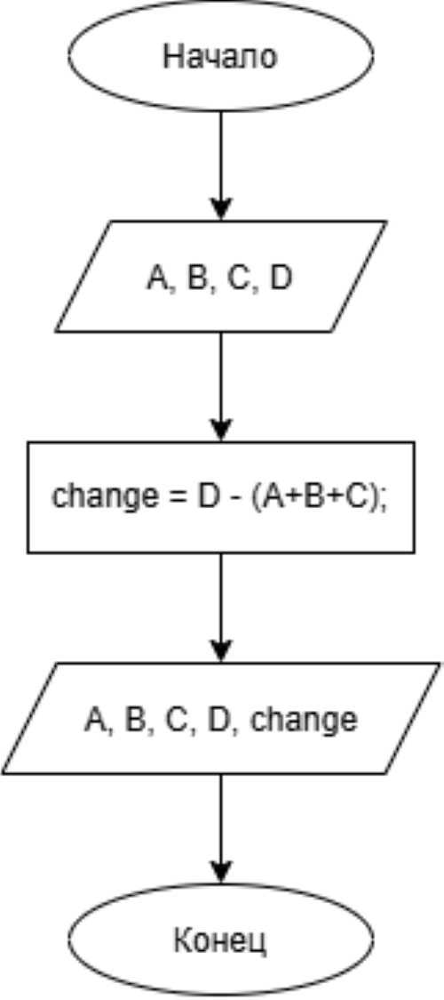
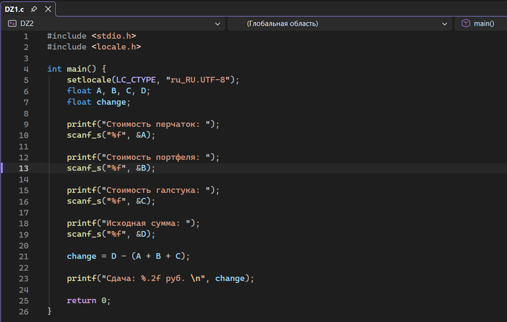
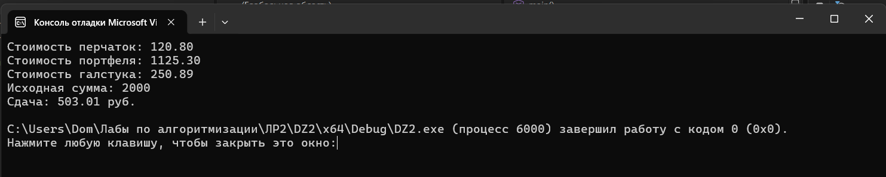

# Домашнее задание к работе 2

## Условия задачи
Составьте программу для определения сдачи после покупки в магазине товара:
перчаток стоимостью А руб., портфеля стоимостью Б руб., галстука стоимостью С руб.
Исходная сумма, выделенная на покупку – Д руб. В случае нехватки денег сдача
получится отрицательной.

## 1. Алгоритм и блок-схема

### Алгоритм
1. **Начало**
2. Задать исходные данные:
    - `A` - стоимость перчаток (руб.).
    - `B` - стоимость портфеля (руб.).
    - `C` - стоимость галстука (руб.).
    - `D` — исходная сумма денег, выделенная на покупку (руб.).
3. Вычислить размер сдачи:
    - `change` = `D` - (`A` + `B` + `C`)
4. Вывести результат расчета на экран в текстовом формате с точностью до двух знаков после запятой.
9. **Конец**

### Блок-схема
 

 [https://vk.ru/away.php?to=https%3A%2F%2Fdrive.google.com%2Ffile%2Fd%2F1TzKVOncmQxCgRCD4OuH6J0DcoNlttgAZ%2Fview%3Fusp%3Dsharing&utf=1]

## 2. Реализация программы

 

## 3. Результаты работы программы

## 4. Информация о разработчике
Орлова Эльвира Эдуардовна
Группа: бИД-261
